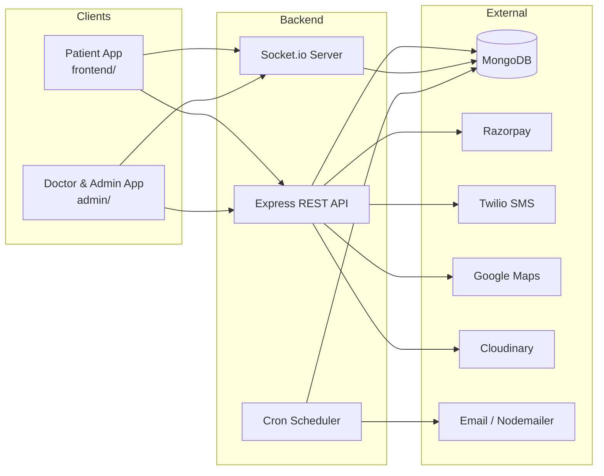
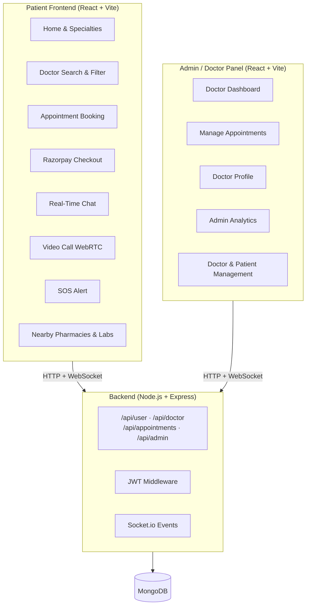
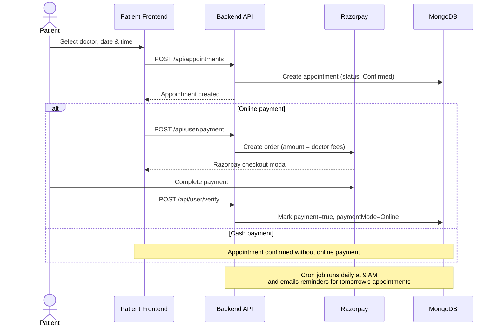
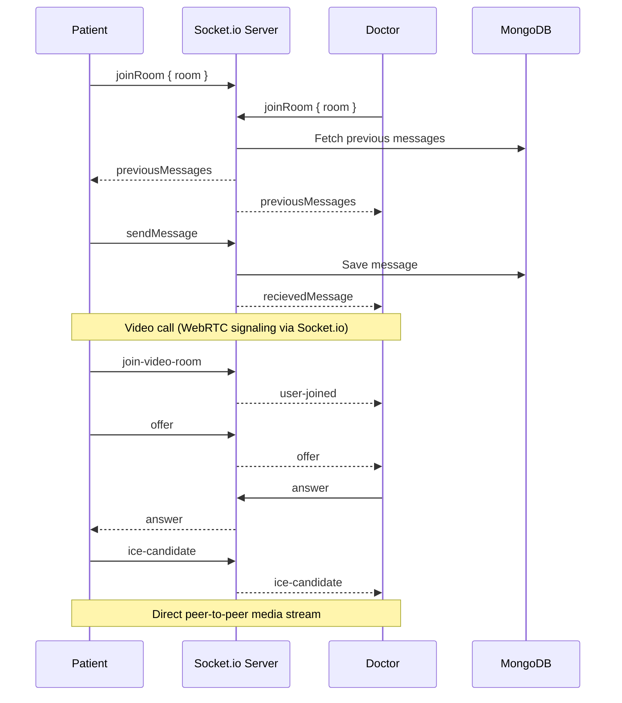
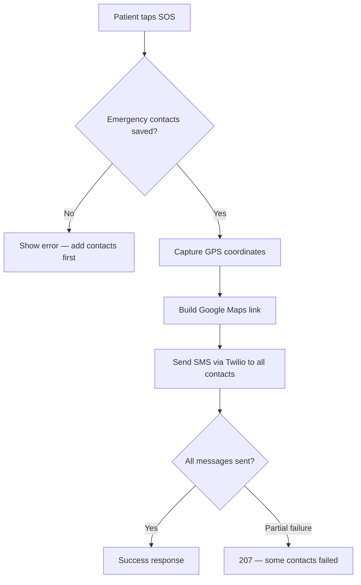
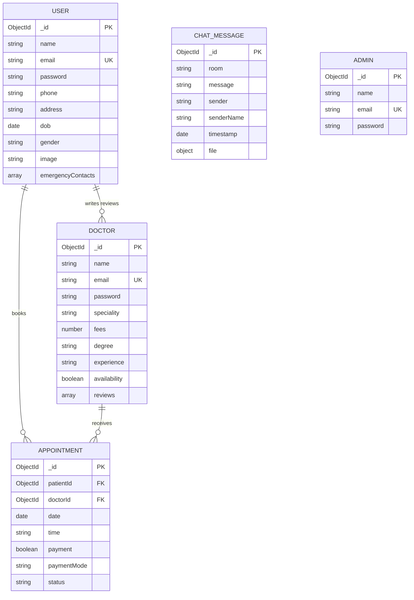

# MedifyPro — Smart Healthcare Management System

**MedifyPro** is a full-stack digital healthcare platform that connects patients with doctors for appointment booking, online payments, real-time chat, video consultations, emergency SOS alerts, and location-based health services. The system is split into three applications — a patient-facing web app, a doctor/admin dashboard, and a shared REST + WebSocket API.

---

## Table of Contents

- [Overview](#overview)
- [System Architecture](#system-architecture)
- [User Roles & Features](#user-roles--features)
- [Key Workflows](#key-workflows)
- [Tech Stack](#tech-stack)
- [Project Structure](#project-structure)
- [API Overview](#api-overview)
- [Database Schema](#database-schema)
- [Getting Started](#getting-started)
- [Environment Variables](#environment-variables)
- [Deployment](#deployment)
- [Project Preview](#project-preview)
- [Contributing](#contributing)
- [Contact](#contact)

---

## Overview

MedifyPro addresses the gap between patients seeking care and doctors managing their practice. Patients can browse doctors by specialty, book and pay for appointments, chat with their doctor, join video calls, trigger SOS alerts to emergency contacts, and find nearby pharmacies or diagnostic labs. Doctors manage their profile, availability, and appointments from a dedicated dashboard. Admins oversee the entire platform — adding doctors, viewing analytics, and monitoring patient activity.



---

## System Architecture

The project follows a **monorepo** layout with three independently deployable apps that share one backend.

| Application | Directory | Port (dev) | Purpose |
|-------------|-----------|------------|---------|
| **Patient Frontend** | `frontend/` | `5173` (Vite default) | Public-facing site for patients |
| **Doctor & Admin Panel** | `admin/` | `5174` (Vite default) | Doctor login, admin dashboard, analytics |
| **Backend API** | `backend/` | `8080` | REST API, Socket.io, cron jobs |



### Authentication

Three separate JWT-protected roles share the same `JWT_SECRET` but use different middleware:

| Role | Middleware | Token source |
|------|------------|--------------|
| Patient | `auth.js` | `POST /api/user/login` |
| Doctor | `doctorAuth.js` | `POST /api/doctor/login` |
| Admin | `adminAuth.js` | `POST /api/admin/login` |

---

## User Roles & Features

### Patient (Frontend)

| Feature | Description |
|---------|-------------|
| **Doctor discovery** | Browse and filter doctors by name, specialty, rating, fees, and availability |
| **Appointment booking** | Select date/time, pay online via Razorpay or choose cash |
| **Reviews & ratings** | Leave and manage reviews for doctors (1–5 stars) |
| **Real-time chat** | Text and file sharing with doctors via Socket.io rooms |
| **Video consultations** | Peer-to-peer video calls using WebRTC with Socket.io signaling |
| **Emergency SOS** | One-tap SMS alerts with live GPS location sent to emergency contacts (Twilio) |
| **Nearby services** | Find pharmacies and diagnostic labs via Google Maps Places API |
| **Profile management** | Update personal info and profile photo (Cloudinary upload) |

### Doctor (Admin Panel)

| Feature | Description |
|---------|-------------|
| **Dashboard** | View appointment stats and upcoming schedule |
| **Availability** | Toggle online/offline status and manage time slots |
| **Appointments** | View, confirm, complete, or cancel patient appointments |
| **Profile** | Update specialty, fees, experience, and profile image |
| **Video calls** | Join WebRTC rooms with patients for teleconsultations |
| **Chat** | Respond to patient messages in real time |

### Admin (Admin Panel)

| Feature | Description |
|---------|-------------|
| **Analytics dashboard** | Charts for doctors by specialty, monthly appointments, top doctors |
| **Doctor management** | Add, list, and remove doctors from the platform |
| **Patient management** | View registered patients |
| **Platform overview** | Total doctors, patients, and appointments at a glance |

---

## Key Workflows

### Appointment Booking & Payment



### Real-Time Chat & Video Calls



### Emergency SOS



> **Note:** Twilio's free trial only delivers SMS to manually verified phone numbers. For production use, upgrade to a paid Twilio account.

---

## Tech Stack

| Layer | Technologies |
|-------|-------------|
| **Patient UI** | React 18, Vite 6, Tailwind CSS, DaisyUI, Framer Motion, React Router |
| **Admin / Doctor UI** | React 19, Vite 6, Tailwind CSS 4, Chart.js, React Router |
| **Backend** | Node.js, Express 4, Mongoose 8 |
| **Database** | MongoDB |
| **Authentication** | JWT, bcryptjs |
| **Payments** | Razorpay |
| **Real-time** | Socket.io (chat, typing indicators, WebRTC signaling) |
| **Video** | WebRTC (peer-to-peer) |
| **Notifications** | Nodemailer (email), Twilio (SMS) |
| **File storage** | Cloudinary (profile images, chat attachments) |
| **Maps** | Google Maps Places API |
| **Scheduling** | node-cron (daily appointment reminders) |
| **Deployment** | Vercel (frontends), Render (backend) |

---

## Project Structure

```
health/
├── frontend/                  # Patient-facing React app
│   ├── src/
│   │   ├── components/      # Navbar, DoctorFilter, DisplayDoctor, etc.
│   │   └── pages/           # Home, Doctors, Appointment, Chat, VideoCall, Profile
│   └── package.json
│
├── admin/                     # Doctor & Admin dashboard
│   ├── src/
│   │   ├── components/      # Sidebar, DashboardLayout
│   │   └── pages/
│   │       ├── Admin/       # AdminDashboard, DoctorList, AddDoctor, PatientList
│   │       └── Doctor/      # DoctorDashboard, Appointment, Profile, VideoCall
│   └── package.json
│
└── backend/                   # Express API + Socket.io
    ├── controller/          # Business logic (user, doctor, admin, appointment, maps)
    ├── middleware/            # auth.js, doctorAuth.js, adminAuth.js
    ├── model/                 # Mongoose schemas (user, doctor, appointment, chat, admin)
    ├── routes/                # Route definitions
    ├── servies/               # Email service (Nodemailer)
    ├── util/                  # DB connection, Cloudinary, cron scheduler
    └── app.js                 # Entry point — Express + Socket.io server
```

---

## API Overview

### Users — `/api/user`

| Method | Endpoint | Auth | Description |
|--------|----------|------|-------------|
| `POST` | `/register` | — | Register a new patient |
| `POST` | `/login` | — | Patient login, returns JWT |
| `GET` | `/profile` | Patient | Get logged-in user profile |
| `PUT` | `/profile` | Patient | Update profile (supports image upload) |
| `PUT` | `/emergency-contact` | Patient | Add emergency contacts |
| `POST` | `/sos-alert` | Patient | Trigger SOS SMS to emergency contacts |
| `POST` | `/payment` | Patient | Create Razorpay order for appointment |
| `POST` | `/verify` | Patient | Verify Razorpay payment |
| `GET` | `/nearby-places` | — | Find nearby pharmacies or labs |

### Doctors — `/api/doctor`

| Method | Endpoint | Auth | Description |
|--------|----------|------|-------------|
| `POST` | `/signup` | — | Register a new doctor |
| `POST` | `/login` | — | Doctor login |
| `GET` | `/all` | — | List all doctors |
| `GET` | `/:doctorId` | — | Get doctor by ID |
| `PUT` | `/:doctorId` | Doctor | Update doctor profile |
| `POST` | `/:doctorId/review` | Patient | Add a review |
| `GET` | `/:doctorId/average-rating` | — | Get average rating |

### Appointments — `/api/appointments`

| Method | Endpoint | Auth | Description |
|--------|----------|------|-------------|
| `POST` | `/` | Patient | Book an appointment |
| `GET` | `/user` | Patient | Get patient's appointments |
| `GET` | `/doctor/:id` | Doctor | Get doctor's appointments |
| `PUT` | `/:appointmentId/status` | Patient | Change appointment status |

### Admin — `/api/admin`

| Method | Endpoint | Auth | Description |
|--------|----------|------|-------------|
| `POST` | `/login` | — | Admin login |
| `POST` | `/adminDashboard` | — | Fetch platform analytics |
| `POST` | `/doctorDashboard` | Doctor | Fetch doctor-specific stats |

### Other

| Method | Endpoint | Description |
|--------|----------|-------------|
| `POST` | `/api/search-filter` | Search and filter doctors |
| `POST` | `/api/chat/upload` | Upload file attachment in chat |

### Socket.io Events

| Event | Direction | Purpose |
|-------|-----------|---------|
| `joinRoom` | Client → Server | Join a chat room, load history |
| `sendMessage` | Client → Server | Send a text message |
| `recievedMessage` | Server → Client | Broadcast new message |
| `typing` | Bidirectional | Typing indicator |
| `join-video-room` | Client → Server | Enter a WebRTC room |
| `offer` / `answer` / `ice-candidate` | Bidirectional | WebRTC signaling |
| `end-call` | Bidirectional | End video call |
| `toggle-audio` / `toggle-video` | Bidirectional | Mute/unmute controls |

---

## Database Schema



**Doctor specialties:** General Physician, Gynecologist, Dermatologist, Pediatricians, Neurologist, Gastroenterologist

**Appointment statuses:** Confirmed, Completed, Cancelled

---

## Getting Started

### Prerequisites

- [Node.js](https://nodejs.org/) v18 or later
- [MongoDB](https://www.mongodb.com/) (local instance or [MongoDB Atlas](https://www.mongodb.com/atlas) cluster)
- API keys for Razorpay, Twilio, Google Maps, and Cloudinary (see [Environment Variables](#environment-variables))

### 1. Clone the repository

```bash
git clone https://github.com/nikitachoudhary114/MedifyPro.git
cd MedifyPro
```

### 2. Install dependencies

```bash
# Backend
cd backend
npm install

# Patient frontend
cd ../frontend
npm install

# Doctor & Admin panel
cd ../admin
npm install
```

### 3. Configure environment variables

Create a `.env` file inside `backend/` (see full list below).

### 4. Start the development servers

Open three terminals:

```bash
# Terminal 1 — Backend (port 8080)
cd backend
node app.js

# Terminal 2 — Patient frontend (port 5173)
cd frontend
npm run dev

# Terminal 3 — Doctor & Admin panel (port 5174)
cd admin
npm run dev
```

| App | URL |
|-----|-----|
| Patient frontend | http://localhost:5173 |
| Admin / Doctor panel | http://localhost:5174 |
| Backend API | http://localhost:8080 |

> The frontends are currently configured to call the production API at `https://medifypro-backend.onrender.com`. For local development, update the API base URLs in the frontend and admin source files to `http://localhost:8080`.

---

## Environment Variables

Create `backend/.env` with the following:

```env
# Server
PORT=8080

# Database
MONGO=mongodb+srv://<user>:<password>@<cluster>.mongodb.net/medifypro

# Authentication
JWT_SECRET=your_jwt_secret_here

# Razorpay (payments)
RAZORPAY_KEY_ID=your_razorpay_key_id
RAZORPAY_KEY_SECRET=your_razorpay_key_secret
CURRENCY=INR

# Twilio (SOS SMS)
TWILIO_ACCOUNT_SID=your_twilio_account_sid
TWILIO_AUTH_TOKEN=your_twilio_auth_token
TWILIO_PHONE=+1234567890

# Google Maps (nearby places)
API_KEY=your_google_maps_api_key

# Cloudinary (image & file uploads)
CLOUDINARY_CLOUD_NAME=your_cloud_name
CLOUDINARY_API_KEY=your_api_key
CLOUDINARY_API_SECRET=your_api_secret

# Email (appointment reminders via Nodemailer)
EMAIL_USER=your_email@gmail.com
EMAIL_PASS=your_app_password
```

---

## Deployment

| Component | Platform | Notes |
|-----------|----------|-------|
| **Backend** | [Render](https://render.com) | Set all env vars in the Render dashboard |
| **Patient Frontend** | [Vercel](https://vercel.com) | `vercel.json` handles SPA routing |
| **Admin Panel** | [Vercel](https://vercel.com) | Deploy `admin/` as a separate project |

**Live backend:** `https://medifypro-backend.onrender.com`

---

## Project Preview

A full walkthrough of the application is available here:

[View Project Recording](https://drive.google.com/file/d/1vRnheXZJRMMIgX5egjSzOk22RPW-_Ou8/view?usp=sharing)

---

## Contributing

Contributions are welcome. To get started:

1. Fork the repository
2. Create a feature branch (`git checkout -b feature/your-feature`)
3. Commit your changes
4. Open a pull request

Please open an issue first if you plan a large change so it can be discussed.

---

## Contact

Built by **Nikita Choudhary**

- Email: [nikitachoudhary364@gmail.com](mailto:nikitachoudhary364@gmail.com)
- LinkedIn: [linkedin.com/in/nikita-choudhary2005](https://www.linkedin.com/in/nikita-choudhary2005/)
- GitHub: [github.com/nikitachoudhary114](https://github.com/nikitachoudhary114)

---

<p align="center">Made with care for better healthcare access.</p>
